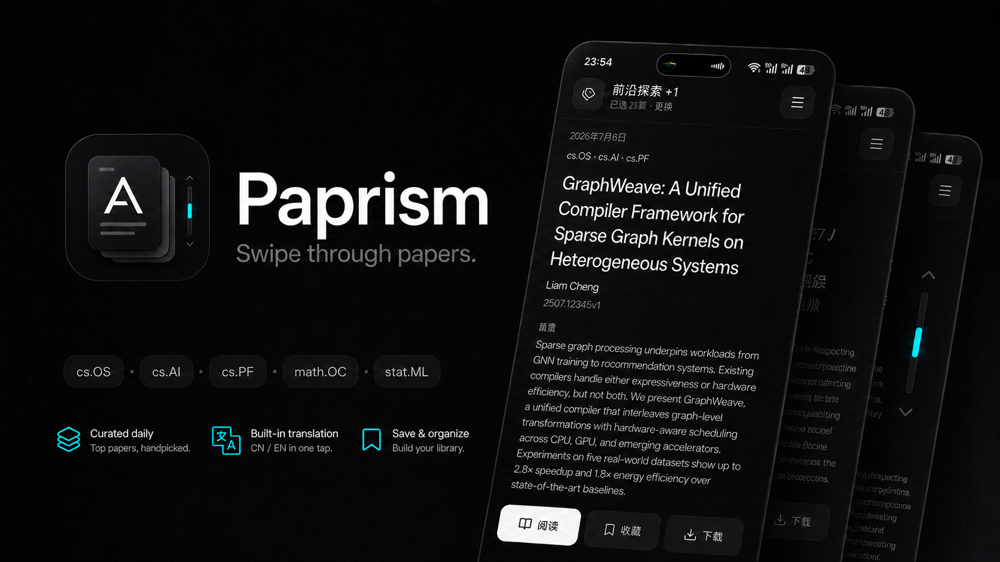

<p align="center">
  
</p>

<h1 align="center">Paprism</h1>

<p align="center">
  <strong>Discover, read, translate, and save arXiv papers from one focused Android app.</strong>
</p>

<p align="center">
  
  
  
  
</p>

<p align="center">
  <a href="https://github.com/AetherAllan/Paprism/releases/latest"><strong>Download APK</strong></a>
  ·
  <a href="#quick-start">Quick start</a>
  ·
  <a href="#what-you-can-do">Features</a>
</p>

## Research should feel browsable

Paprism turns the arXiv feed into a fast, vertical reading experience. Swipe
through new papers, open a native reader, translate difficult sections, and
keep the work worth returning to — without creating an account or depending on
an application backend.

## What you can do

| Discover                                 | Read                                            | Translate                                        | Keep                                 |
| ---------------------------------------- | ----------------------------------------------- | ------------------------------------------------ | ------------------------------------ |
| Swipe through fresh paper cards          | Open selectable text, math, tables, and figures | Translate lazily with section context            | Save papers and revisit history      |
| Combine multiple arXiv categories        | Navigate long papers by section                 | Use keyless Google or your own provider key      | Store offline reader packages        |
| Search globally or within your selection | Download the original PDF                       | Configure OpenRouter or OpenAI-compatible models | Export downloads through Android SAF |

### Built for focused reading

- **Fast discovery:** 20 papers per page with background prefetching near the
  end of the feed.
- **Native paper reader:** arXiv HTML becomes a structured document instead of
  a cramped web page.
- **Bilingual workflow:** the interface supports English and 中文, while paper
  translation is loaded only when requested.
- **Local ownership:** saved papers, history, downloads, and provider profiles
  stay on the device.
- **No application backend:** the app talks directly to the official arXiv API
  and your selected translation provider.

## Quick start

### Requirements

- [Bun](https://bun.sh)
- Android Studio and Android native build tools
- An Android device or emulator with network access to arXiv

The reader uses native modules, so Expo Go is not supported.

```bash
git clone https://github.com/AetherAllan/Paprism.git
cd Paprism
bun install
bun run android
```

After the development client is installed, use Metro for normal
JavaScript/TypeScript changes:

```bash
bun run dev
```

Rebuild the native client after changing native dependencies or `app.json`:

```bash
bunx expo prebuild --clean
bun run android
```

## How it works

```text
Official arXiv Atom API
          ↓
Rate-limited feed and search
          ↓
Native document parser and reader
          ↓
On-demand translation + local library
```

- **Source:** `https://export.arxiv.org/api/query`
- **Rate limit:** requests are serialized with at least 3 seconds between
  starts, following arXiv's API guidance.
- **Prefetch:** each page contains 20 papers; the next page begins loading when
  four remain ahead.
- **Provider keys:** stored in the operating system's secure storage and never
  persisted in normal application storage.

## Development

```bash
bun test
bun run typecheck
bun run format
```

The source is organized by product feature:

```text
index.ts
Roadmap/
src/
  App.tsx
  features/
    feed/
    library/
    viewer/
    categories/
    settings/
  shared/
  lib/
  i18n/
  types/
```

<details>
<summary><strong>Android release process</strong></summary>

Releases run only when started manually from GitHub Actions.

One-time setup:

1. Add `EXPO_TOKEN` as a GitHub Actions secret.
2. Create the Android keystore on EAS if it does not exist:

   ```bash
   bunx eas-cli build -p android --profile production
   ```

3. Initialize EAS's remote Android `versionCode` from the latest completed
   build:

   ```bash
   bunx eas-cli build:version:set -p android -e production
   ```

To publish, open **Actions → Release APK → Run workflow**, then select `patch`,
`minor`, `major`, or `retry`. The workflow tests the source, updates the single
version in `package.json`, builds on EAS, verifies every APK, and only then
creates the matching Git tag and GitHub Release.

Each release contains `arm64-v8a`, `armeabi-v7a`, `x86_64`, and universal APKs.
See [the release notes](Roadmap/release.md) for the artifact design.

</details>

## Roadmap

- [Native bilingual reader architecture](Roadmap/immersive-translation.md)
- [APK packaging and release verification](Roadmap/release.md)

## License

[MIT](LICENSE) © 2026 AetherAllan
