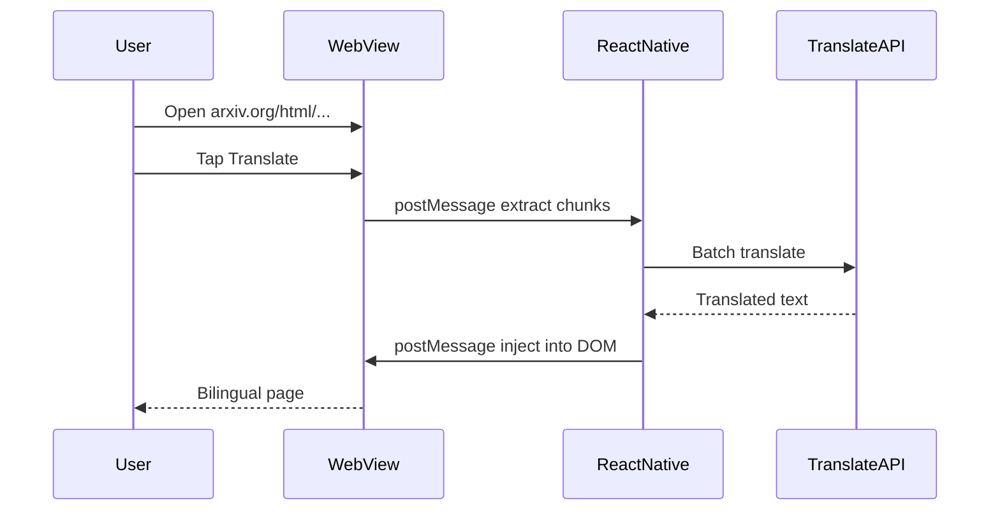

# Immersive translation in the HTML reader

Replace the current Google URL proxy with in-page bilingual translation, inspired by [Immersive Translate](https://immersivetranslate.com/).

## Current state

[`PaperViewer.tsx`](../src/features/viewer/PaperViewer.tsx) toggles between:

- Original: `https://arxiv.org/html/{id}`
- “Translated”: `https://translate.google.com/translate?u=...`

Problems: whole-page proxy, layout/math breakage, SSL issues, uneven quality, no engine choice.

## Target experience

1. WebView always loads the **original** arXiv HTML.
2. User taps **Translate** → translations are **injected into the DOM** (not a redirect).
3. Default display: **dual mode** — original paragraph above, translation below (Immersive Translate style).
4. Multiple named OpenRouter / OpenAI-compatible profiles; user supplies the API key.
5. **No backend** — device calls translation APIs directly (BYOK for premium engines).

## Architecture mapping

| Immersive Translate (browser) | ArxivTok |
|------------------------------|----------|
| Content script (DOM walk, inject) | WebView `injectedJavaScript` |
| Background script (API calls) | React Native layer (`fetch`) |
| `chrome.runtime.sendMessage` | `WebView.onMessage` / `postMessage` |
| Options page (engine + key) | [`SettingsScreen`](../src/features/settings/SettingsScreen.tsx) |

WebView JS should **not** call third-party APIs directly (keys would leak). RN owns network + secrets.



## Core behaviors (from Immersive Translate)

### Dual mode (default)

Keep original nodes; insert translation below each block:

```html
<p>
  Original paragraph…
  <span class="arxivtok-translation">Translated paragraph…</span>
</p>
```

Inject minimal CSS (muted color, spacing). Revert to source by removing `.arxivtok-translation` nodes — no full reload.

### Display states

| State | UI |
|-------|-----|
| `source` | Original only |
| `dual` | Original + translation (default) |
| `translation` | Translation only (optional later) |

Replace the current `translated: boolean` toggle with a small state machine.

### DOM rules (arXiv-specific)

Traverse text nodes; **skip**:

- `script`, `style`, `code`, `pre`
- `math` / MathML (critical for papers)
- Nodes already marked translated
- Skip when detected source language equals target

**Phase 1 scope:** translate `<p>` inside article body only. Skip title, authors, references, figure captions.

### Segmentation & lazy translation

- Group text into **paragraph units** (better context, fewer API calls).
- **Dynamic mode:** translate visible viewport first (`IntersectionObserver` in inject JS), then scroll-triggered batches — do not translate the full paper on first tap.
- Show progress + allow cancel for long papers.

### Multi-engine (pluggable)

```ts
type TranslateProvider = {
  id: string;
  translate(chunks: string[], from: string, to: string): Promise<string[]>;
};
```

| Engine | Quality | Cost model | Role |
|--------|---------|------------|------|
| OpenRouter | Model-dependent | BYOK; free models available | Primary path |
| OpenAI-compatible | Service-dependent | BYOK | Direct alternative |

There is no shared application key or zero-configuration proxy. OpenRouter's live
model catalog ranks free models first; compatible endpoints can load `/models` or
fall back to manual model input.

### Caching

Cache by `(arxivId, targetLang, provider)` on device (e.g. file system or AsyncStorage for small jobs). Avoid re-translating on every open.

## Phased rollout

### Phase 1 — Replace Google proxy

- [x] Fixed URI: always original online or offline arXiv HTML
- [x] injectJS + validated `onMessage` bridge
- [x] OpenRouter and OpenAI-compatible BYOK profiles
- [x] Dual mode for headings, paragraphs and body list items
- [x] Progress, cancel and retry controls

### Phase 2 — Immersive parity (lite)

- [x] Multiple named provider profiles + encrypted API key storage
- [x] Scroll/lazy translation
- [x] Local translation cache
- [x] `source` / `dual` modes (`translation`-only intentionally deferred)

### Phase 3 — Optional

- [ ] arXiv glossary / AI context for terminology
- [ ] Feed card abstract translation (separate from reader)

## Code touchpoints

| File | Change |
|------|--------|
| [`src/features/viewer/PaperViewer.tsx`](../src/features/viewer/PaperViewer.tsx) | Remove Google URL; WebView bridge + modes |
| [`src/features/viewer/`](../src/features/viewer/) | Bridge, queue, provider client and cache |
| [`src/features/settings/`](../src/features/settings/) | Profiles, models and encrypted keys |
| [`src/features/settings/SettingsScreen.tsx`](../src/features/settings/SettingsScreen.tsx) | Engine + key UI |
| [`src/i18n/locales/*.json`](../src/i18n/locales/) | New strings |

## Out of scope (for now)

- PDF in-WebView translation
- Video / image OCR translation
- Hosted proxy backend (conflicts with no-backend design unless added later)

## References

- [Immersive Translate](https://immersivetranslate.com/)
- Current reader: [`PaperViewer.tsx`](../src/features/viewer/PaperViewer.tsx)
- Translation language prefs: [`storage.ts`](../src/lib/storage.ts), [`SettingsScreen.tsx`](../src/features/settings/SettingsScreen.tsx)
